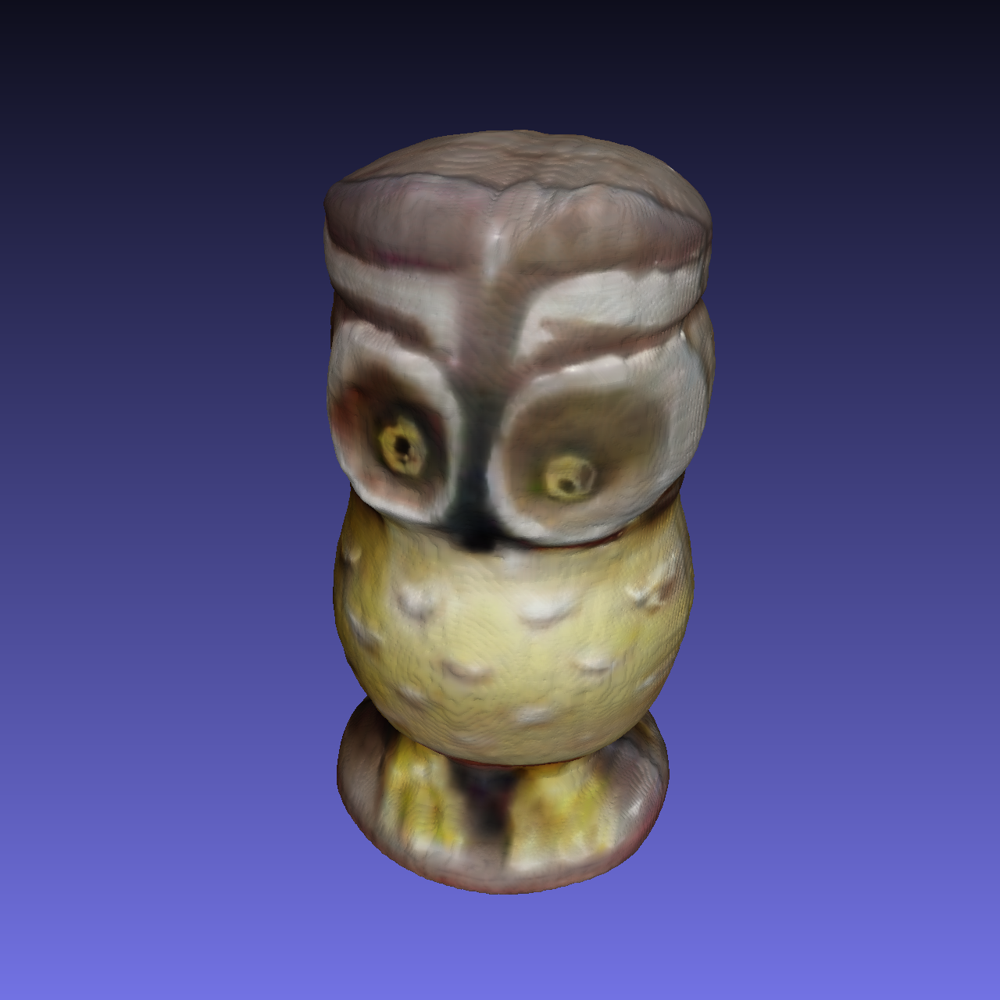
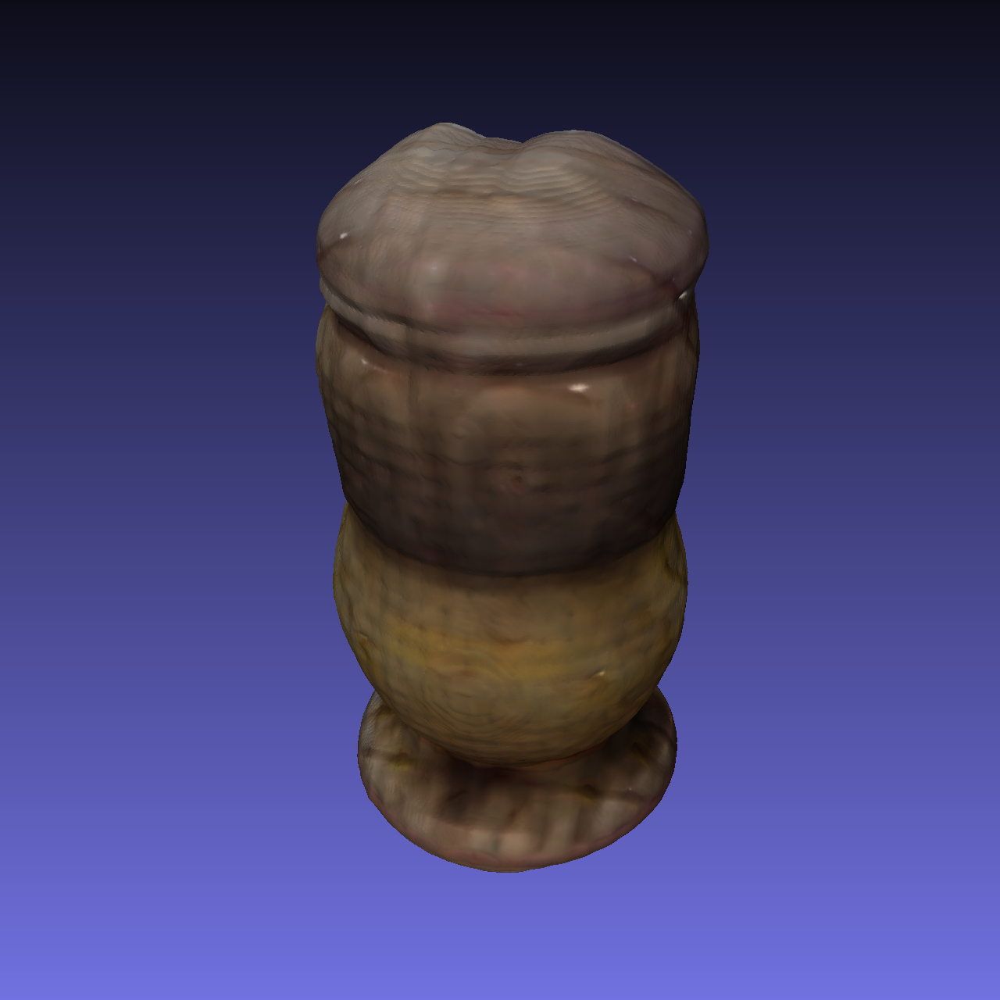
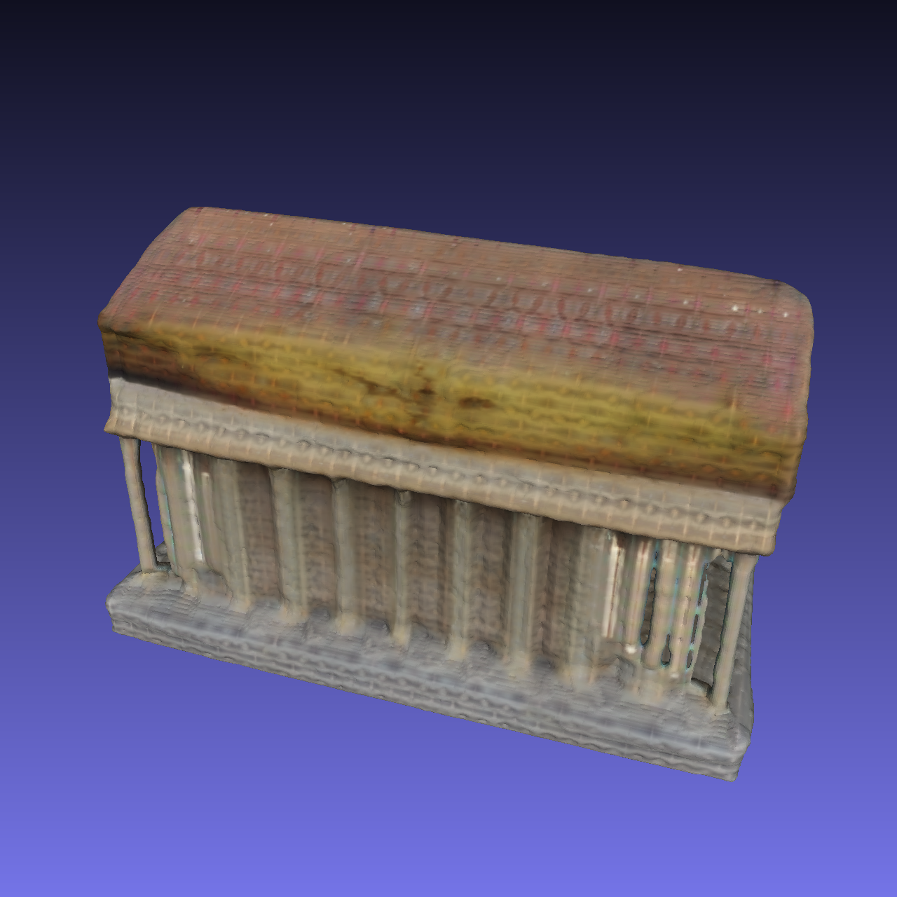
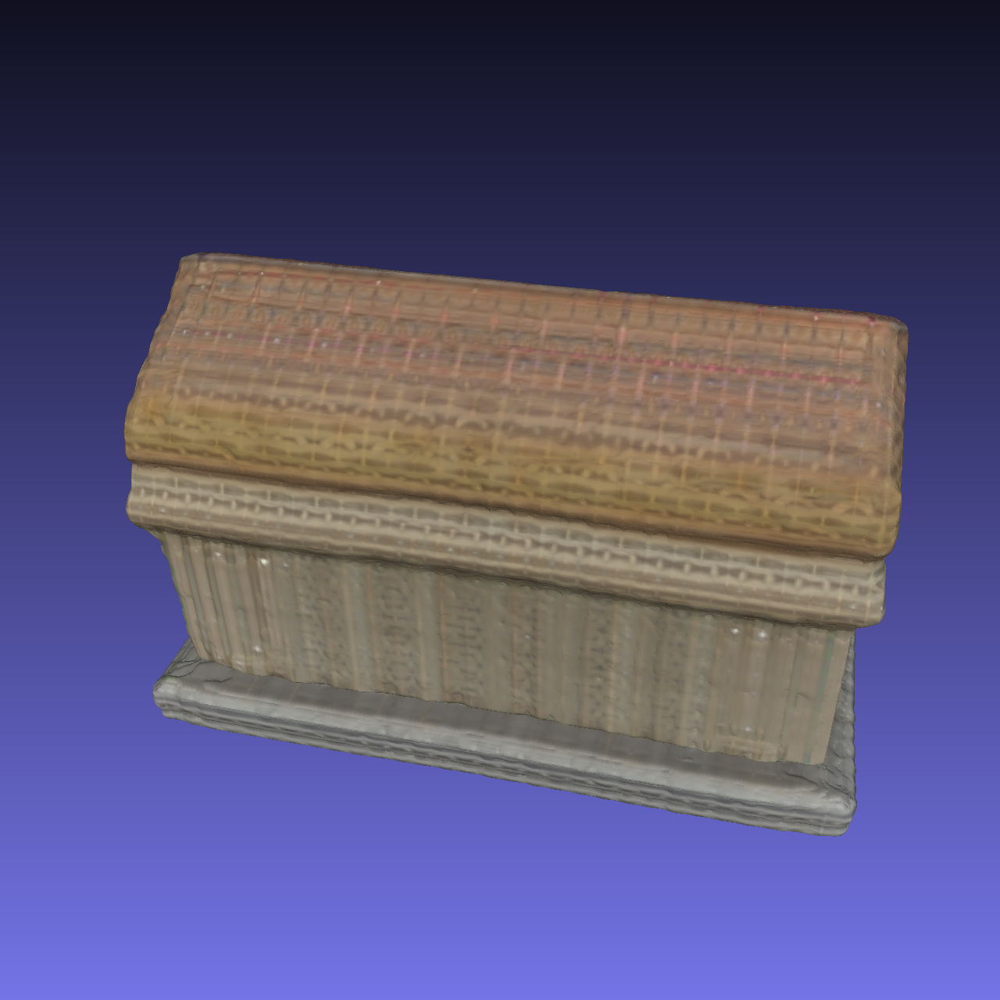
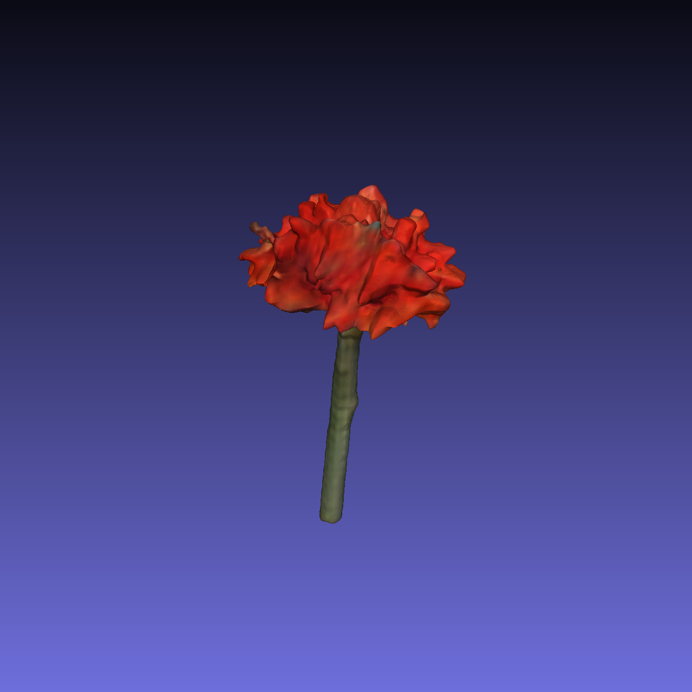
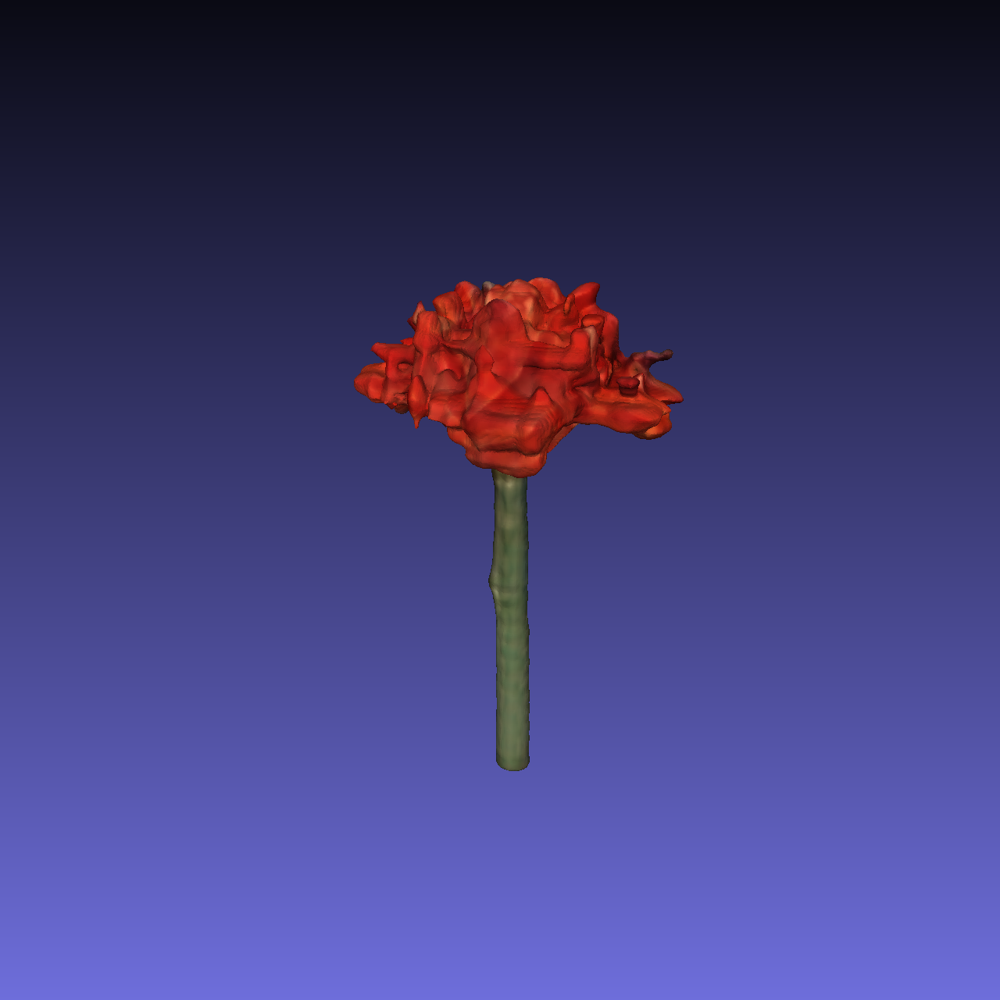

# OpenLRM-Refine: 前馈式三维重建中的频谱阻抗失配研究

> 这是 [3DTopia/OpenLRM](https://github.com/3DTopia/OpenLRM) 的研究分支。本仓库在原始 OpenLRM 推理与训练管线基础上，加入了一套针对编码器误差结构与解码器频谱响应的诊断与修正实验代码，配套实验结果与论文草稿位于 `exps/` 目录。原版 OpenLRM 的 README 保留在下方供查阅。

[](LICENSE)
[](LICENSE_WEIGHT)
[](https://arxiv.org/abs/2311.04400)

## 研究概要

本工作以 OpenLRM-Mix-Base-1.1 为研究对象，量化诊断了前馈式编码器-解码器三维重建管线中的**频谱阻抗失配（Spectral Impedance Mismatch）** 现象，并提出参数高效的 **LoRA-FreqLoss** 微调方案。核心发现：

- **失配现象**：编码器残差以高频为主（占 47–52% 能量），解码器却为低通放大器（低频敏感度是高频的 2.4 倍）。结果是仅 15–17% 的低频残差贡献了 53–77% 的渲染退化。
- **等价类陷阱**：Triplane 优化景观存在被 L1 距离约 2.0 分隔的多个等价盆地。直接以随机初始化的 Oracle 做残差分析等同于比较两个无关解。本文提出 `pred-init` 锚定策略消除该混淆。
- **低维误差结构**：渲染相关的编码器误差栖身于极低维子空间（rank-4 LoRA 的 147K 参数即可达到 LPIPS 全局最优）。
- **LoRA-FreqLoss 修正**：仅用全模型 0.09% 的可训练参数实现 LPIPS 11.4% 提升、PSNR +1.9 dB、L1 -16.6%，且无任何样本退化。

## 复现关键实验

新增的实验脚本均在 `scripts/` 目录下，结果可视化在 `exps/`。完整方法论见仓库根目录 `实验二报告.md`（论文草稿）。

```bash
# 1. 下载 Objaverse 物体并用 Blender 渲染 32 视角（参考脚本）
python scripts/render_objaverse_subset.py

# 2. 优化 Pred-Init Oracle Triplane（核心方法论修正）
python scripts/optimize_gt_triplane.py \
    --data_dir ./data/rendered/<uid> \
    --output_dir ./exps/gt_triplane \
    --num_iters 2000 --lr 0.01 \
    --init_from_pred

# 3. 频段选择性因果干预（验证频谱阻抗失配）
python scripts/spatial_frequency_analysis.py \
    --triplane_path ./exps/gt_triplane/<uid>_triplane.pt

# 4. 解码器频谱传递函数 H(f) 测量
python scripts/decoder_sensitivity_and_calibration.py \
    --triplane_path ./exps/gt_triplane/<uid>_triplane.pt

# 5. LoRA-FreqLoss 微调（主方案）
python scripts/finetune_lora_freq.py \
    --rank 4 --freq_weight 5.0 --freq_cutoff 0.3 \
    --steps 500 --lr 5e-4

# 6. LoRA Rank 消融
python scripts/lora_rank_ablation.py
```

## 实验结果索引

| 子目录 | 内容 |
|---|---|
| `exps/residual_vis/` | Triplane 残差热力图与 3D 表面误差点云 |
| `exps/frequency_analysis_predinit/` | Pred-Init 基准下的 Triplane 残差功率谱 |
| `exps/decoder_analysis/` | 解码器频谱传递函数 $H(f)$ 经验测量 |
| `exps/spatial_freq/` | 频段选择性因果干预（低频/高频修正对比） |
| `exps/lowfreq_decomp/` | DC 与结构化低频的内部分解 |
| `exps/latent_refine/` | 测试时优化（TTO）失败案例 |
| `exps/finetune_freq_v2/` | 全量微调对照实验 |
| `exps/lora_freq/` | LoRA-FreqLoss 主实验 |
| `exps/lora_ablation/` | LoRA Rank 消融（r ∈ {2, 4, 8, 16, 32}）|
| `exps/visibility_analysis/` | 可见性分组的误差对比（排除遮挡假设）|

---

# 原始 OpenLRM README

[](https://huggingface.co/zxhezexin)
[](https://huggingface.co/spaces/zxhezexin/OpenLRM)


<div style="text-align: left">
    
    
    
    
    
    
</div>

## News

- [2024.03.13] Update [training code](openlrm/runners/train) and release [OpenLRM v1.1.1](https://github.com/3DTopia/OpenLRM/releases/tag/v1.1.1).
- [2024.03.08] We have released the core [blender script](scripts/data/objaverse/blender_script.py) used to render Objaverse images.
- [2024.03.05] The [Huggingface demo](https://huggingface.co/spaces/zxhezexin/OpenLRM) now uses `openlrm-mix-base-1.1` model by default. Please refer to the [model card](model_card.md) for details on the updated model architecture and training settings.
- [2024.03.04] Version update v1.1. Release model weights trained on both Objaverse and MVImgNet. Codebase is majorly refactored for better usability and extensibility. Please refer to [v1.1.0](https://github.com/3DTopia/OpenLRM/releases/tag/v1.1.0) for details.
- [2024.01.09] Updated all v1.0 models trained on Objaverse. Please refer to [HF Models](https://huggingface.co/zxhezexin) and overwrite previous model weights.
- [2023.12.21] [Hugging Face Demo](https://huggingface.co/spaces/zxhezexin/OpenLRM) is online. Have a try!
- [2023.12.20] Release weights of the base and large models trained on Objaverse.
- [2023.12.20] We release this project OpenLRM, which is an open-source implementation of the paper [LRM](https://arxiv.org/abs/2311.04400).

## Setup

### Installation
```
git clone https://github.com/3DTopia/OpenLRM.git
cd OpenLRM
```

### Environment
- Install requirements for OpenLRM first.
  ```
  pip install -r requirements.txt
  ```
- Please then follow the [xFormers installation guide](https://github.com/facebookresearch/xformers?tab=readme-ov-file#installing-xformers) to enable memory efficient attention inside [DINOv2 encoder](openlrm/models/encoders/dinov2/layers/attention.py).

## Quick Start

### Pretrained Models

- Model weights are released on [Hugging Face](https://huggingface.co/zxhezexin).
- Weights will be downloaded automatically when you run the inference script for the first time.
- Please be aware of the [license](LICENSE_WEIGHT) before using the weights.

| Model | Training Data | Layers | Feat. Dim | Trip. Dim. | In. Res. | Link |
| :--- | :--- | :--- | :--- | :--- | :--- | :--- |
| openlrm-obj-small-1.1 | Objaverse | 12 | 512 | 32 | 224 | [HF](https://huggingface.co/zxhezexin/openlrm-obj-small-1.1) |
| openlrm-obj-base-1.1 | Objaverse | 12 | 768 | 48 | 336 | [HF](https://huggingface.co/zxhezexin/openlrm-obj-base-1.1) |
| openlrm-obj-large-1.1 | Objaverse | 16 | 1024 | 80 | 448 | [HF](https://huggingface.co/zxhezexin/openlrm-obj-large-1.1) |
| openlrm-mix-small-1.1 | Objaverse + MVImgNet | 12 | 512 | 32 | 224 | [HF](https://huggingface.co/zxhezexin/openlrm-mix-small-1.1) |
| openlrm-mix-base-1.1 | Objaverse + MVImgNet | 12 | 768 | 48 | 336 | [HF](https://huggingface.co/zxhezexin/openlrm-mix-base-1.1) |
| openlrm-mix-large-1.1 | Objaverse + MVImgNet | 16 | 1024 | 80 | 448 | [HF](https://huggingface.co/zxhezexin/openlrm-mix-large-1.1) |

Model cards with additional details can be found in [model_card.md](model_card.md).

### Prepare Images
- We put some sample inputs under `assets/sample_input`, and you can quickly try them.
- Prepare RGBA images or RGB images with white background (with some background removal tools, e.g., [Rembg](https://github.com/danielgatis/rembg), [Clipdrop](https://clipdrop.co)).

### Inference
- Run the inference script to get 3D assets.
- You may specify which form of output to generate by setting the flags `EXPORT_VIDEO=true` and `EXPORT_MESH=true`.
- Please set default `INFER_CONFIG` according to the model you want to use. E.g., `infer-b.yaml` for base models and `infer-s.yaml` for small models.
- An example usage is as follows:

  ```
  # Example usage
  EXPORT_VIDEO=true
  EXPORT_MESH=true
  INFER_CONFIG="./configs/infer-b.yaml"
  MODEL_NAME="zxhezexin/openlrm-mix-base-1.1"
  IMAGE_INPUT="./assets/sample_input/owl.png"

  python -m openlrm.launch infer.lrm --infer $INFER_CONFIG model_name=$MODEL_NAME image_input=$IMAGE_INPUT export_video=$EXPORT_VIDEO export_mesh=$EXPORT_MESH
  ```

### Tips
- The recommended PyTorch version is `>=2.1`. Code is developed and tested under PyTorch `2.1.2`.
- If you encounter CUDA OOM issues, please try to reduce the `frame_size` in the inference configs.
- You should be able to see `UserWarning: xFormers is available` if `xFormers` is actually working.

## Training

### Configuration
- We provide a sample accelerate config file under `configs/accelerate-train.yaml`, which defaults to use 8 GPUs with `bf16` mixed precision.
- You may modify the configuration file to fit your own environment.

### Data Preparation
- We provide the core [Blender script](scripts/data/objaverse/blender_script.py) used to render Objaverse images.
- Please refer to [Objaverse Rendering](https://github.com/allenai/objaverse-rendering) for other scripts including distributed rendering.

### Run Training
- A sample training config file is provided under `configs/train-sample.yaml`.
- Please replace data related paths in the config file with your own paths and customize the training settings.
- An example training usage is as follows:

  ```
  # Example usage
  ACC_CONFIG="./configs/accelerate-train.yaml"
  TRAIN_CONFIG="./configs/train-sample.yaml"

  accelerate launch --config_file $ACC_CONFIG -m openlrm.launch train.lrm --config $TRAIN_CONFIG
  ```

### Inference on Trained Models
- The inference pipeline is compatible with huggingface utilities for better convenience.
- You need to convert the training checkpoint to inference models by running the following script.

  ```
  python scripts/convert_hf.py --config <YOUR_EXACT_TRAINING_CONFIG> convert.global_step=null
  ```

- The converted model will be saved under `exps/releases` by default and can be used for inference following the [inference guide](https://github.com/3DTopia/OpenLRM?tab=readme-ov-file#inference).

## Acknowledgement

- We thank the authors of the [original paper](https://arxiv.org/abs/2311.04400) for their great work! Special thanks to Kai Zhang and Yicong Hong for assistance during the reproduction.
- This project is supported by Shanghai AI Lab by providing the computing resources.
- This project is advised by Ziwei Liu and Jiaya Jia.

## Citation

If you find this work useful for your research, please consider citing:
```
@article{hong2023lrm,
  title={Lrm: Large reconstruction model for single image to 3d},
  author={Hong, Yicong and Zhang, Kai and Gu, Jiuxiang and Bi, Sai and Zhou, Yang and Liu, Difan and Liu, Feng and Sunkavalli, Kalyan and Bui, Trung and Tan, Hao},
  journal={arXiv preprint arXiv:2311.04400},
  year={2023}
}
```

```
@misc{openlrm,
  title = {OpenLRM: Open-Source Large Reconstruction Models},
  author = {Zexin He and Tengfei Wang},
  year = {2023},
  howpublished = {\url{https://github.com/3DTopia/OpenLRM}},
}
```

## License

- OpenLRM as a whole is licensed under the [Apache License, Version 2.0](LICENSE), while certain components are covered by [NVIDIA's proprietary license](LICENSE_NVIDIA). Users are responsible for complying with the respective licensing terms of each component.
- Model weights are licensed under the [Creative Commons Attribution-NonCommercial 4.0 International License](LICENSE_WEIGHT). They are provided for research purposes only, and CANNOT be used commercially.
